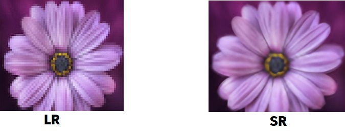
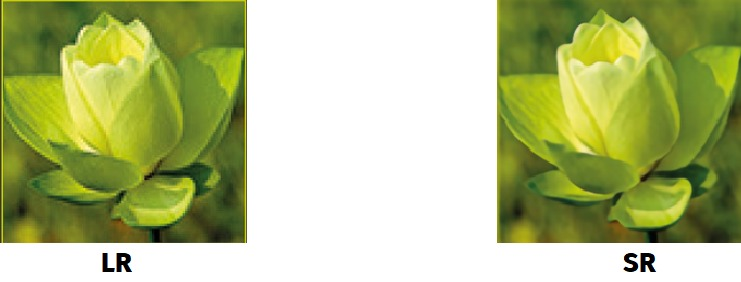
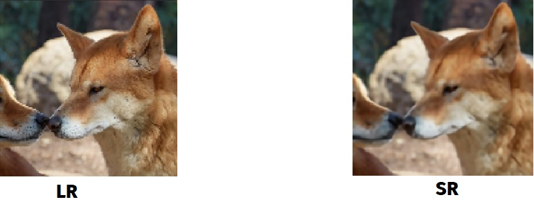

# SRGAN


### (SRGAN) with pytorch

we build a model that can realistically increase image resolution.
🚀 using `PyTorch 1.4` in `Python 3.6`.

---

**30 Mar 2020**: Code is now available , you can run the code in  [google colab](https://github.com/mstgdy/SRGAN/blob/master/Aphrodite.ipynb).

---
Super-resolution (SR) models essentially hallucinate new pixels where previously there were none.

We implemente [_Photo-Realistic Single Image Super-Resolution Using a Generative Adversarial Network_](https://arxiv.org/abs/1609.04802). It's not just that the results are very impressive... it's also a great introduction to GANs!

---

## SRGAN Architecture

<div align="center">
	
</div>

### Our Results

the first training was *100 epoch*

<div align="center">
	



---



---



</div>

---

## The Training
### Our Checkpoints are available [SRGAN (TAR)](https://drive.google.com/open?id=1ePooVQcEbIjEZfE2ED1dmtCVj-xUbg1c).
you can download it . we train about 3000 epoch from  [DIV2K](https://data.vision.ee.ethz.ch/cvl/DIV2K/) dataset . if you want to train another dataset, this [link](https://drive.google.com/open?id=1qEEX29LyVP2NjNxYw2WR-KcehjdSCjEM)for our project you can run file : train-srgan.py

we upload the dataset to google drive , to train it in google colab , this article helped us for  [Downloading Datasets into Google Drive via Google Colab](https://towardsdatascience.com/downloading-datasets-into-google-drive-via-google-colab-bcb1b30b0166).

--- 

## the results
with the paper's results in parantheses:

||PSNR|SSIM||PSNR|SSIM||PSNR|SSIM|
|:---:|:---:|:---:|:---:|:---:|:---:|:---:|:---:|:---:|
|**SRResNet**|31.927 (32.05)|0.902 (0.9019)||28.588 (28.49)|0.799 (0.8184)||27.587 (27.58)|0.756 (0.7620)|
|**SRGAN**|29.719 (29.40)|0.859 (0.8472)||26.509 (26.02)|0.729 (0.7397)||25.531 (25.16)|0.678 (0.6688)|
||**Set5**|**Set5**||**Set14**|**Set14**||**BSD100**|**BSD100**|

---

## Run
you can run the code using [google colab](https://github.com/mstgdy/SRGAN/blob/master/Aphrodite.ipynb).:
in the third cell -
just change the ``` url ``` in ```afro(url)``` 

---

### Reference
* [1] [Photo-Realistic Single Image Super-Resolution Using a Generative Adversarial Network](https://arxiv.org/abs/1609.04802)
* [2] [SRGAN: Training Dataset Matters](https://arxiv.org/abs/1903.09922)
